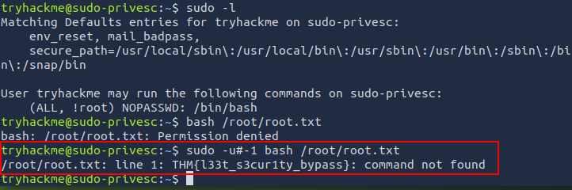

# 🛡️ Sudoers-Bypass-Analyse: CVE-2019-14287


## Inhaltsverzeichnis
- [Einleitung](#einleitung)
- [Erhöhung der Privilegien durch fehlerhafte UID-Validierung](#erhöhung-der-privilegien-durch-fehlerhafte-uid-validierung)
    - [1. Überblick und Klassifizierung](#1-überblick-und-klassifizierung)
    - [2. Funktionsweise und Technische Details](#2-funktionsweise-und-technische-details)
    - [3. Penetration Test: Validierung des Exploits](#3-penetration-test-validierung-des-exploits)
    - [4. Gegenmaßnahmen und Patches](#4-gegenmaßnahmen-und-patches)
- [Nützliche Links](#nützliche-links)
- [Haftungsausschluss](#haftungsausschluss)


<div align=right>

[↑ Inhaltsverzeichnis](#inhaltsverzeichnis)

</div>


## Einleitung
Du kannst auf **tryhackme.com** den Raum [Sudo Security Bypass](https://tryhackme.com/room/sudovulnsbypass) besuchen, um mehr über diese Schwachstelle zu erfahren und sie in den eigenen Labs ausprobieren.


<div align=right>

[↑ Inhaltsverzeichnis](#inhaltsverzeichnis)

</div>


## Erhöhung der Privilegien durch fehlerhafte UID-Validierung
### 1. Überblick und Klassifizierung


| Attribut | Wert |
|----------|------|
| CVE-ID | CVE-2019-14287 |
| Kategorie | Privilege Escalation (PE) |
| Betroffenes Produkt | Sudo (Versionszweig 1.8.28 und älter) |
| Schweregrad (CVSS v3.1) | 9.8 (Critical) |
| Schwachstellentyp | Improper Input Validation (Fehlerhafte Eingabevalidierung) |
| Benötigte Konfiguration | Spezifische `sudoers`-Regel (`!root`-Ausschluss) |


<div align=right>

[↑ Inhaltsverzeichnis](#inhaltsverzeichnis)

</div>


### 2. Funktionsweise und Technische Details
#### 2.1 Der Kern der Schwachstelle

Die Schwachstelle beruht auf einem Fehler in der Validierungslogik des `sudo`-Befehls beim Parsen einer numerischen Benutzer-ID (UID), die über die Option `-u` angegeben wird.

Normalerweise erlaubt die `sudoers`-Konfiguration dem Administrator, Regeln zu definieren, die es einem Benutzer gestatten, Befehle als eine beliebige andere UID auszuführen, mit Ausnahme einer explizit ausgeschlossenen UID (z. B. `root`).

Wenn ein Benutzer die Option `-u` verwendet, um eine numerische ID (`#UID`) anzugeben, wird diese ID von `sudo` in eine interne Variable konvertiert. Wenn der Benutzer die numerische ID `-1` oder ihren äquivalenten, nicht signierten 32-Bit-Wert `4294967295` (entsprechend `0xFFFFFFFF`) angibt, interpretiert `sudo` diesen Wert intern als **0**, also die Root-UID.


<div align=right>

[↑ Inhaltsverzeichnis](#inhaltsverzeichnis)

</div>


#### 2.2 Bedingung für die Ausnutzung

Die Ausnutzung ist nur möglich, wenn die `sudoers`-Datei eine Regel enthält, die den Benutzer zwar zur Ausführung von Befehlen als alle Benutzer berechtigt, aber explizit die Root-UID ausschließt.

Typische anfällige Regel in `/etc/sudoers`:

```text
user_name ALL=(ALL, !root) NOPASSWD: /path/to/command
```

In diesem Fall glaubt `sudo`, dass es die `!root`-Bedingung korrekt durchsetzt, wenn es die ID des Zielbenutzers prüft. Da die numerische Angabe von `-1` intern zu `0` (root) konvertiert wird, wird diese Prüfung jedoch umgangen, und der Befehl wird als Root ausgeführt.


<div align=right>

[↑ Inhaltsverzeichnis](#inhaltsverzeichnis)

</div>


#### 2.3 Schematische Darstellung des Bypass

```text
+------------------+           +------------------+
|    User Input    |           | Sudo Validation  |
+------------------+           +------------------+
| sudo -u#-1 cmd   | --------> | target_uid = -1  |
+------------------+           +------------------+
                                       |
                                       V
                               +-------------------+
                               | Sudo Internal Map |
                               +-------------------+
                               | unsigned(-1) = 0  |  <--- **BYPASS**
                               | (Root UID)        |
                               +-------------------+
                                       |
+-------------------------------------------------------+
|               ACL Check: "Is target_uid != root?"     |
|  (Rule: ALL, !root)          |                        |
|  Check: 0 != 0?              | NO -> Exclusion Fails  |
|  Result: Execute as Root     |                        |
+-------------------------------------------------------+
```


<div align=right>

[↑ Inhaltsverzeichnis](#inhaltsverzeichnis)

</div>


### 3. Penetration Test: Validierung des Exploits
#### 3.1 Zielsystem-Analyse (`sudo -l`)

Ziel der Analyse: Prüfen, ob eine anfällige `sudoers`-Regel existiert.

| Schritt | Befehl | Analyse |
|---------|--------|---------|
| 1. | `sudo -l` | Überprüfung der dem aktuellen Benutzer zugewiesenen `sudo`-Rechte. |
| 2. | Erkannte Regel | `(ALL, !root) NOPASSWD: /bin/bash` |
| 3. | Validierung | Die Regel entspricht der anfälligen Konfiguration: Der Benutzer darf alle Befehle als alle Benutzer außer Root ausführen. |


<div align=right>

[↑ Inhaltsverzeichnis](#inhaltsverzeichnis)

</div>


#### 3.2 Exploitation des Privilegien-Bypass

Ziel der Ausführung: Den zugewiesenen Befehl (`/bin/bash`) unter Umgehung des `!root`-Ausschlusses als Root (UID 0) starten, um Root-Dateien zu lesen.

| Schritt | Befehl | Erwartetes Ergebnis | Tatsächliches Ergebnis |
|---------|--------|---------------------|------------------------|
| 1. | `sudo -u#-1 bash /root/root.txt` | Der Befehl sollte aufgrund der `!root`-Regel fehlschlagen. | Der Befehl wird als Root ausgeführt, die Datei `/root/root.txt` wird gelesen. |


<div align=right>

[↑ Inhaltsverzeichnis](#inhaltsverzeichnis)

</div>


#### Nachweis der erfolgreichen Ausnutzung:

Durch die erfolgreiche Ausgabe des Dateiinhalts von `/root/root.txt` wurde die Privilege Escalation von einem normalen Benutzer auf Root-Rechte erfolgreich demonstriert und verifiziert. Der Bypass über die UID `# -1` hat die `sudoers`-Regel `!root` effektiv negiert.




<div align=right>

[↑ Inhaltsverzeichnis](#inhaltsverzeichnis)

</div>


### 4. Gegenmaßnahmen und Patches

Die Schwachstelle [CVE-2019-14287](https://www.cve.org/CVERecord?id=CVE-2019-14287) wurde durch die Korrektur der Eingabevalidierung in der `sudo`-Software behoben.

Empfehlung:

- **Aktualisierung:** Sofortiges Update von `sudo` auf Version 1.8.29 oder höher.

- **Konfigurations-Härtung:** Obwohl gepatcht, sollte die Verwendung von `(ALL, !root)`-Regeln in Produktionsumgebungen als hochriskant betrachtet und vermieden werden, da sie ein hohes Missbrauchspotenzial aufweisen.


## Nützliche Links
- [TryHackeMe: Sudo Security Bypass](https://tryhackme.com/room/sudovulnsbypass)


<div align=right>

[↑ Inhaltsverzeichnis](#inhaltsverzeichnis)

</div>


## Haftungsausschluss

Dieses Repository dient ausschließlich zu Ausbildungs-, Forschungs- und Demonstrationszwecken im Bereich der IT-Sicherheit.

Alle hier dokumentierten Techniken und Tools dürfen nur in legalen und autorisierten Testumgebungen verwendet werden – z. B. in Labors, CTFs oder mit ausdrücklicher Genehmigung des Eigentümers der Zielsysteme.

Wir distanzieren uns ausdrücklich von jeglicher illegalen Nutzung.
Dieses Projekt richtet sich an White-Hat-Sicherheitsforscher, Ethical Hacker und Auszubildende, die ethisch und rechtlich korrekt handeln.

[Disclaimer](/00-disclaimer/disclaimer.md)

--- 

Stay curious – stay secure. 🔐

🗓️ **Letzte Aktualisierung:** Oktober 2025  
🤝 **Pull Requests willkommen** – Vorschläge für neue Kurse oder Kategorien gerne einreichen!

---